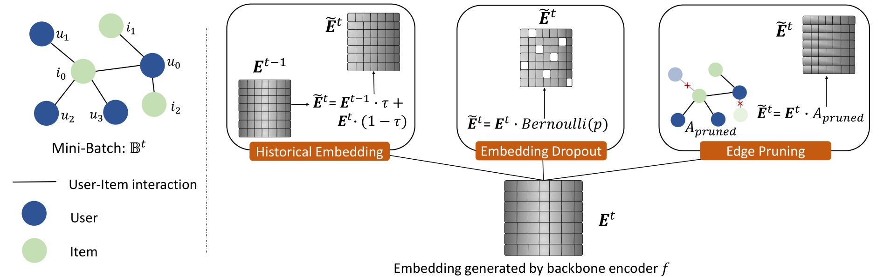

# SelfCF: A Simple Framework for Self-supervised Collaborative Filtering

This is our implementation of the paper:

Xin Zhou, Aixin Sun, Yong Liu, Jie Zhang, Chunyan Miao. SelfCF: A Simple Framework for Self-supervised Collaborative Filtering [http://arxiv.org/abs/2107.03019](http://arxiv.org/abs/2107.03019). 

## Overview

We present a simple framework that specialized for collaborative filtering problem. The framework enables learning of latent representations of users and items **without Negative Samples**.  
We augment the output embeddings generated from backbone networks instead of the input user-item ids. For output embedding augmentation, we propose three technologies:  
- Historical embedding.
- Embedding dropout.
- Edge pruning.  

For details, please refer to the paper. 

## Features  
- Standard data preprocessing.  
- Unified data splitting with global-timeline.  
- Standard evaluation protocols.   
- Posterior recommendation results.

## Data  
Download from Google Drive: [MovieLens/MOOC/Amazon-Vedio-Game](https://drive.google.com/drive/folders/1WqRAeoWWGdZplYkjS4640V7v0urNiTXg?usp=sharing)  

## Environment:  

python	3.6  
pytorch	1.8  
PyYAML	0.1.7  
pandas	0.24  
numpy 1.19  

## ACK:
We would like to give thanks to the following repo:  
[RecBole](https://github.com/RUCAIBox/RecBole)  
[BUIR](https://github.com/donalee/BUIR)

